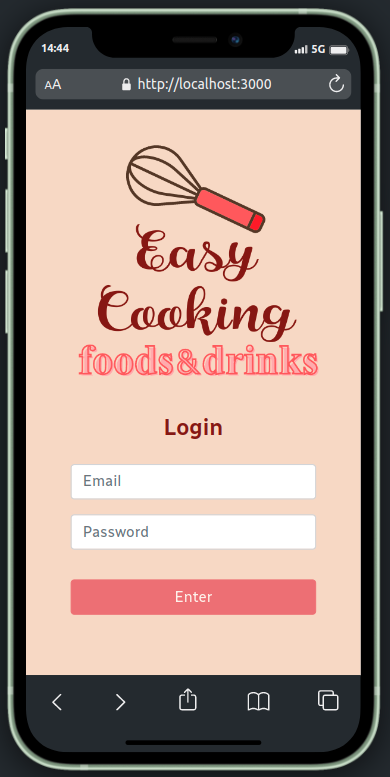
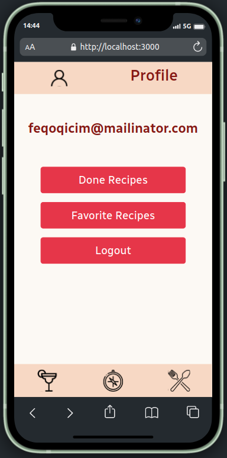
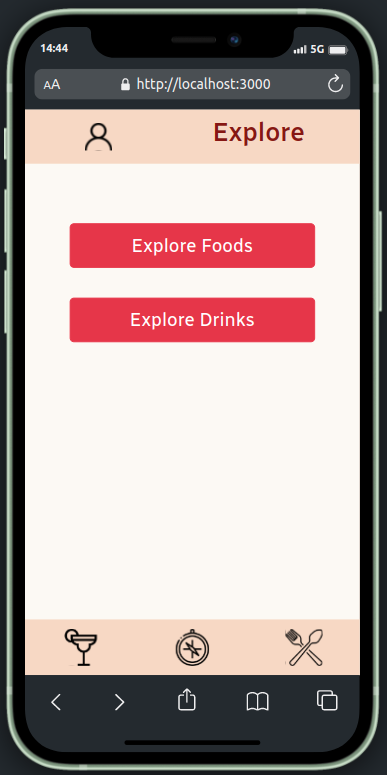
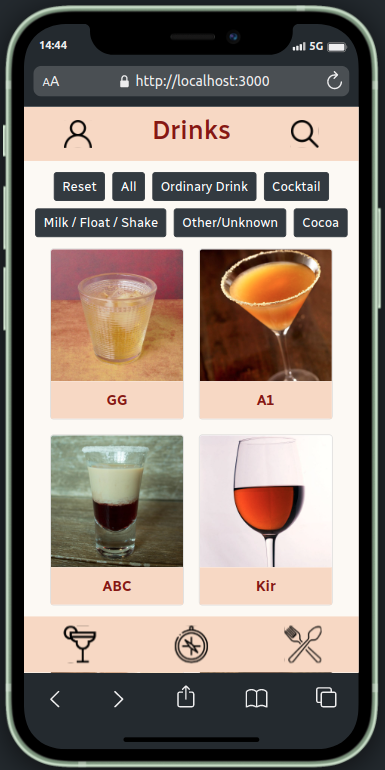
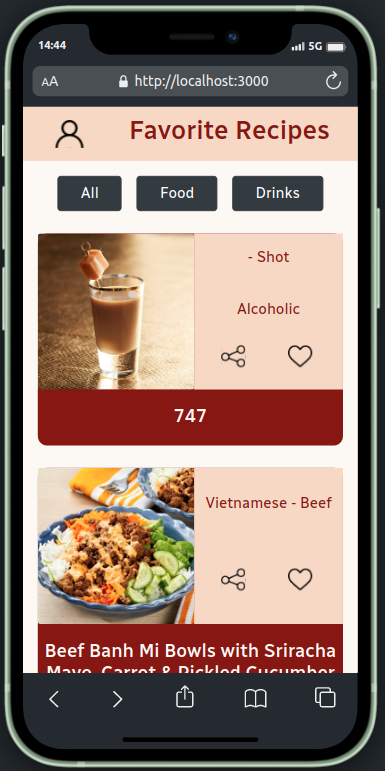

# 🍲🍹 App Recipes Project - Easy Cooking

  

Last project of the Front-end module in a group developed during the Web Development course at [Trybe](https://www.betrybe.com/).

We developed with 5 coworkers a recipe app, using **React Hooks**, **Context API** and **SCRUM** agile methodology.

## 👥 The team
||||
:-:|:-:|:-:|:-:|:-:
[Hugo Mafra](https://github.com/Hugorc10)|[Tamiris Shigaki](https://github.com/TamirisShigaki)|[Tiemi Faustino](https://github.com/tiemifaustino)|[Gabriel Pesch](https://github.com/GabrielPesch)|[Alexandre Eggers](https://github.com/eggersss)

## ✨ Features
 - Global state management with **Redux**.
 - Async API fetching with **Redux Thunk**.
 - Style with **Bootstrap**.
 - SPA navigation with **React Router DOM**.
 - TDD using **Cypress**.
 - **RTL** unit test development.

## 🎉 Application

Check it out [here](https://easycooking-app.vercel.app/) our project in your browser!

**Note:** the application was developed in `360 x 640` screen resolution. See in this resolution or on your cell phone.

## 📹 Demo

<h2 align="center">Login - Profile - Explore</h2>

<div align="center">
  
  
  
</div>

<h2 align="center">Foods - Drinks - Favorite Recipes</h2>

<div align="center">
  
  
  
</div>

## 💻 Run Locally

Clone the project

```bash
  git clone git@github.com:tiemifaustino/easycooking-app.git
```

Go to the project directory

```bash
  cd easycooking-app
```

Install dependencies

```bash
  npm install
```

Start the server

```bash
  npm run start
```

